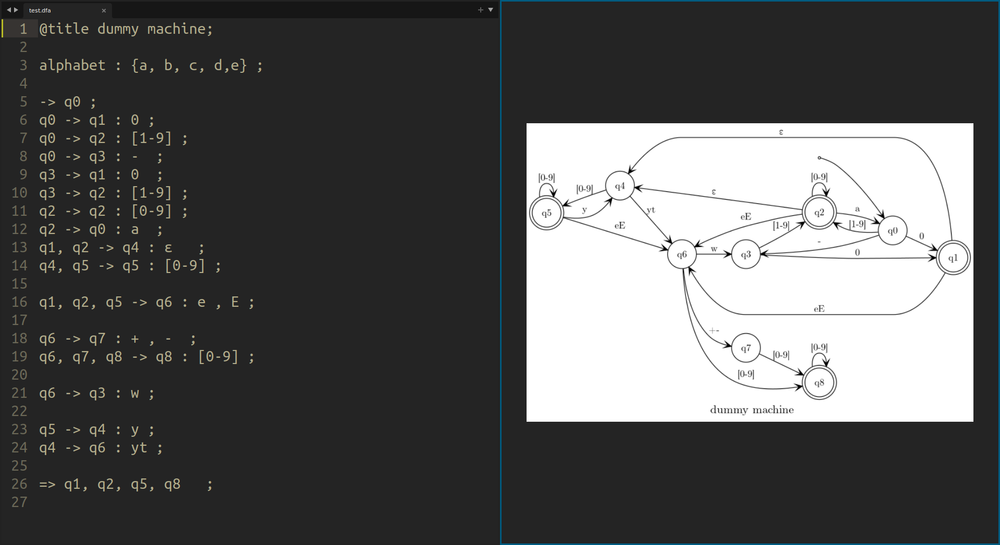

# Automata-CLI

[](https://github.com/TheBSD/StandWithPalestine/blob/main/docs/README.md)




## Automata language structure

- declaring starting state, if multiple statements are supplied the **first one** will be considered
```
-> state ;
```

- declaring accepting state, if multiple statements are supplied the **union** will be considered

  -> comma-separated values 
```
=> state1,state2,state3,... ; 
```

- declaring alphabet, if multiple statements are supplied the **union** will be considered

  -> comma-separated values inside curly braces. 
```
alphabet : {s1, s2, s3, ... }; 
```

- declaring transition statement

1- 
  -> comma-separated values -> state : comma-separated values 
```
state1,state2,state3,... -> statei : s1,s2,.. ; 
```

2- 
  -> comma-separated values => state : comma-separated values

  in this case statei will be added to accepting states
```
state1,state2,state3,... => statei : s1,s2,.. ; 
```

of course you don't have to be tied to the above transition declaration
more examples: 
```
q1 -> q2 : w ; 
```  
```
q1 -> q1 : ε ; 
```  

```
q1, q3 -> q2 : [1-9] ; 
```  

```
q1, q3 -> q2 : [1-9], 0 ; 
```  

## Installation


0) install setuptools 

``` shell 
pip install -U setuptools 
```

1) clone the project to your local machine, and change directory to project

``` shell
git clone github.com/mohamedrezk122/automata-cli
cd automata-cli   
```

2) install the program, do one of the following commands 

``` shell 
pip install -e . 
```
or, 
``` shell 
python3 setup.py install 
```

## Usage

- `render`

``` shell 
> automata-cli render --help
Usage: automata-cli render [OPTIONS] FILENAME

  render automata specification source file to whatever

Options:
  -o, --output PATH  output file path, default output.[format]  [default:output]
  -c, --config PATH  configuration file path if not specified the default
                     configs will be loaded  [default: config.yaml]
  -f, --format TEXT  output format can be [pdf|png|eps|svg|gif|...]  [default:png]
  -s, --keep_source  keep graphviz source file, default False
  -v, --view         view output in default application, default False
  --help             Show this message and exit.

```
- `export` 

``` shell
> automata-cli export --help
Usage: automata-cli export [OPTIONS] FILENAME

  export automata specification source to tex format for latex embedding

Options:
  -o, --output PATH               output file path, default output.[format]
                                  [default: output]
  -c, --config PATH               configuration file path if not specified the
                                  default configs will be loaded  [default:config.yaml]
  -f, --format [pstricks|pgf|pst|tikz|psn]
                                  output format   [default: tikz]
  --help                          Show this message and exit.

```

- `minimize` (not fully implemented yet)

## Current bugs

- different rendering for the same file content 
 
## TODO

- add more options for tex export, to clone the graphviz behavior 
- handle the encodings to allow latin and greek symbols 
- complete the minimization algorithm  

## Contributing
Contributions are welcome, feel free to request/add features, point to any bug, or 
at least share your opinion. 

## License
This project is licensed under MIT License.

## Inspired by

- [https://github.com/sergiouph/am-editor](https://github.com/sergiouph/am-editor ) and his deployed site [https://sergiouph.github.io/am-editor/](https://sergiouph.github.io/am-editor/)

## Take a look at
- [dot2tex](https://github.com/xyz2tex/dot2tex) : the library used to convert the graphviz dot source code to tex format  
- [graphviz](https://graphviz.readthedocs.io/) : the package used to render the dot source specification, similar one [pydot](https://github.com/pydot/pydot) 
- [networkx](https://github.com/networkx/networkx): used for the graph structure. 